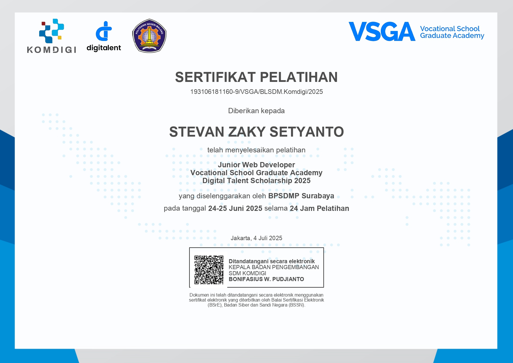
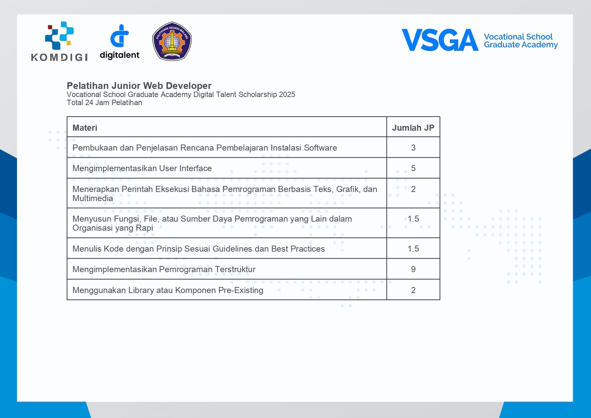

<div align="center">
  
</div>

---

## 👨‍💻 About Me

```javascript
const stevan = {
    fullName: "Stevan Zaky Setyanto",
    role: ["Front End Developer", "Software Engineer"],
    institution: "Politeknik Negeri Malang - Jurusan Teknologi Informasi",
    location: "Malang, Indonesia",
    passions: [
        "Creating innovative web solutions",
        "Building efficient systems",
        "Learning new technologies"
    ],
    currentFocus: "Full-stack Web Development & Front-end developer",
    lifePhilosophy: "Code with passion, build with purpose 💡"
};
```

Passionate developer from Indonesia 🇮🇩 with a focus on creating elegant and efficient web applications. I love turning complex problems into simple, beautiful, and intuitive solutions.

---

## 🛠️ Tech Stack

### Languages


### Frameworks & Libraries


### Databases


### Tools & Others


---

## 📊 GitHub Statistics

<div align="center">
  
  
</div>

<div align="center">
  
</div>

<div align="center">
  
</div>

---

## � Featured Projects

<table>
  <tr>
    <td width="50%">
      <h3 align="center">🎓 FINALIS JTI</h3>
      <div align="center">  
        <a href="https://github.com/vanstevanzaky/FINALIS-JTI-WEB">
          
        </a>
        <p>
          <strong>Web Platform:</strong> Sistem Informasi Bebas Tanggungan Tugas Akhir untuk JTI Polinema
        </p>
        <p>
          <a href="https://github.com/vanstevanzaky/FINALIS-JTI-WEB">
            
          </a>
        </p>
      </div>
    </td>
    <td width="50%">
      <h3 align="center">🧲 MAGNET</h3>
      <div align="center">
        <a href="https://github.com/vanstevanzaky/MAGNET-Magang-Network-And-Tracking">
          
        </a>
        <p>
          <strong>Recommendation System:</strong> Web-based system untuk rekomendasi magang mahasiswa JTI Polinema
        </p>
        <p>
          <a href="https://github.com/vanstevanzaky/MAGNET-Magang-Network-And-Tracking">
            
          </a>
        </p>
      </div>
    </td>
  </tr>
  <tr>
    <td width="50%">
      <h3 align="center">🪡 Raza Bordir</h3>
      <div align="center">
        <a href="https://github.com/vanstevanzaky/Raza-Bordir">
          
        </a>
        <p>
          <strong>Management System:</strong> Sistem informasi manajemen UMKM jasa bordir mesin
        </p>
        <p>
          <a href="https://github.com/vanstevanzaky/Raza-Bordir">
            
          </a>
        </p>
      </div>
    </td>
    <td width="50%">
      <h3 align="center">� PWL POS</h3>
      <div align="center">
        <a href="https://github.com/vanstevanzaky/PWL_POS">
          
        </a>
        <p>
          <strong>POS System:</strong> Point of Sale dengan Laravel - Inventory & Sales Management
        </p>
        <p>
          <a href="https://github.com/vanstevanzaky/PWL_POS">
            
          </a>
        </p>
      </div>
    </td>
  </tr>
  <tr>
    <td width="50%">
      <h3 align="center">📱 Digital Kuota</h3>
      <div align="center">
        <a href="https://github.com/vanstevanzaky/digital-kuota-client">
          
        </a>
        <p>
          <strong>E-Commerce:</strong> Platform digital untuk penjualan kuota internet
        </p>
        <p>
          <a href="https://github.com/vanstevanzaky/digital-kuota-client">
            
          </a>
        </p>
      </div>
    </td>
    <td width="50%">
      <h3 align="center">📚 Machine Learning</h3>
      <div align="center">
        <a href="https://github.com/vanstevanzaky/PEMB_MESIN_LEARING_TI_25-26">
          
        </a>
        <p>
          <strong>ML Projects:</strong> Pembelajaran Mesin - Jupyter Notebooks & Projects
        </p>
        <p>
          <a href="https://github.com/vanstevanzaky/PEMB_MESIN_LEARING_TI_25-26">
            
          </a>
        </p>
      </div>
    </td>
  </tr>
</table>

---

## 🏆 Certifications & Achievements

<div align="center">

### 📜 Junior Web Developer
**Digital Talent Scholarship - Vocational School Graduate Academy 2025**  
Completed 24 hours of intensive training in modern web development

<br>



<br>

<details>
<summary><b>📋 View Training Details & Curriculum</b></summary>
<br>



</details>

<br>

**Training Coverage:**
- ✅ Software Installation & Learning Plan (3 JP)
- ✅ User Interface Implementation (5 JP)
- ✅ Text-Based Programming with Graphics & Multimedia (2 JP)
- ✅ Organizing Functions & Resources (1.5 JP)
- ✅ Writing Code with Best Practices (1.5 JP)
- ✅ Structured Programming Implementation (9 JP)
- ✅ Using Pre-Existing Libraries/Components (2 JP)

**Total: 24 Hours** | **Organizer: BPSDMP Surabaya** | **June 24-25, 2025**

---

### 🎯 GitHub Achievements


</div>

---

## 💼 Portfolio

<div align="center">
  
[](https://vanstevanzaky.github.io/stevan-portofolio/)

Explore my complete portfolio with detailed project showcases, tech stack, and professional achievements.

</div>

---

## 📫 Connect With Me

<div align="center">

[](https://github.com/vanstevanzaky)
[](https://www.linkedin.com/in/stevan-zaky-1638b828a/)
[](https://vanstevanzaky.github.io/stevan-portofolio/)
[](mailto:stevanzaky@example.com)

</div>

---

## � Contribution Graph

<div align="center">
  
</div>

---

<div align="center">
  
### 💭 Quote of the Day
  


---

### 👀 Profile Views


---

### ⚡ Fun Facts

```python
fun_facts = {
    "🌱": "Currently learning Machine Learning & AI",
    "🎯": "Goal: Contribute to open-source projects",
    "💡": "Favorite: Solving complex problems with elegant code",
    "🎮": "Hobby: Gaming & Exploring new technologies",
    "☕": "Powered by: Coffee and determination"
}
```

---


### ⭐ From [vanstevanzaky](https://github.com/vanstevanzaky) with 💜

**"Strive for progress, not perfection"**

</div>
