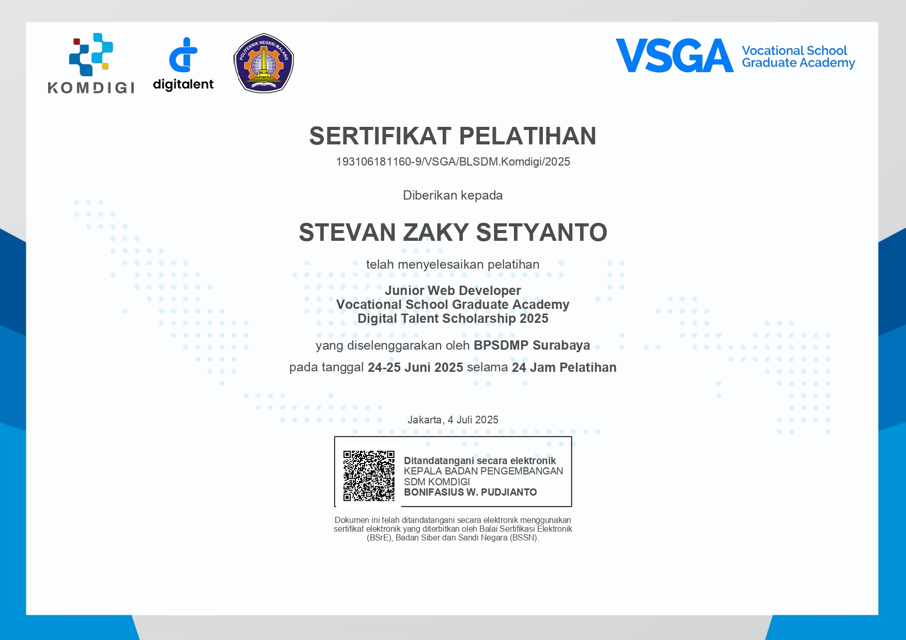

<div align="center">
  
</div>

<div align="center">
  
  
  
</div>

---

## 👨‍💻 About Me

```bash
stevan@soc:~$ whoami
```

```yaml
Name      : Stevan Zaky Setyanto
Role      : Aspiring SOC Analyst | Cybersecurity Enthusiast
Education : D4 Teknik Informatika - Politeknik Negeri Malang (GPA: 3.54/4.00)
Focus     : Security Operations, Log Analysis, Network Monitoring
Background: Web Developer → Transitioning to Cyber Security
Philosophy: "Understand how things are built to know how they can break."
```

Saya adalah mahasiswa Teknik Informatika yang sedang bertransisi dari pengembangan web ke dunia **Cyber Security**, khususnya pada peran **SOC Analyst**. Pengalaman membangun aplikasi web memberikan saya pemahaman mendalam tentang arsitektur client-server, alur data, dan potensi celah keamanan yang sering diabaikan oleh developer — perspektif yang saya anggap sebagai keunggulan unik dalam karier keamanan siber.

---

## 🔐 Cyber Security Skills

```
[■■■■■■░░░░]  Linux CLI & Log Analysis        → grep, tail, filtering, navigasi sistem
[■■■■■░░░░░]  Networking Fundamentals         → TCP/IP, ports, client-server communication
[■■■■░░░░░░]  Security Concepts               → OWASP, authentication, input validation
[■■■■░░░░░░]  Threat Awareness                → Identifikasi potensi risiko pada aplikasi web
[■■■░░░░░░░]  Security Monitoring (Learning)  → Konsep SIEM, log monitoring, incident response
```

**Akan dipelajari:** SIEM fundamentals · Incident Response · Threat Intelligence · Network Traffic Analysis

---

## 🛠️ Tech Stack

### 🔐 Security & System


### 🌐 Web Development


### 🗄️ Database & Tools


---

## 🏆 Certifications

<div align="center">

| Sertifikasi | Penerbit | Tahun |
|---|---|---|
| 🛡️ Introduction to Cybersecurity | Cisco NetAcad | 2026 |
| 🐧 Linux Unhatched | Cisco NetAcad | 2026 |
| 🌐 Networking Basics | Cisco NetAcad | 2026 |
| 💻 Junior Web Developer – VSGA | Digital Talent Scholarship Kominfo | 2025 |

</div>

<details>
<summary><b>📜 Lihat Sertifikat Junior Web Developer (VSGA 2025)</b></summary>
<br>
<div align="center">

</div>

**Training Coverage (24 Jam Pelatihan | BPSDMP Surabaya | 24–25 Juni 2025):**
- ✅ Software Installation & Learning Plan (3 JP)
- ✅ User Interface Implementation (5 JP)
- ✅ Text-Based Programming with Graphics & Multimedia (2 JP)
- ✅ Organizing Functions & Resources (1.5 JP)
- ✅ Writing Code with Best Practices (1.5 JP)
- ✅ Structured Programming Implementation (9 JP)
- ✅ Using Pre-Existing Libraries/Components (2 JP)
</details>

---

## 🔎 Security-Relevant Projects

> Proyek-proyek ini dibangun dari sisi developer — namun saya menganalisanya dari **perspektif keamanan**.

<table>
  <tr>
    <td width="50%">
      <h3 align="center">🧲 MAGNET</h3>
      <div align="center">
        <a href="https://github.com/vanstevanzaky/MAGNET-Magang-Network-And-Tracking">
          
        </a>
        <p>
          Sistem rekomendasi magang berbasis Laravel & Livewire.<br>
          <strong>🔐 Security insight:</strong> Analisis alur validasi input user, keamanan endpoint API, dan potensi IDOR pada sistem rekomendasi.
        </p>
        <a href="https://github.com/vanstevanzaky/MAGNET-Magang-Network-And-Tracking">
          
        </a>
      </div>
    </td>
    <td width="50%">
      <h3 align="center">🎓 FINALIS JTI</h3>
      <div align="center">
        <a href="https://github.com/vanstevanzaky/FINALIS-JTI-WEB">
          
        </a>
        <p>
          Sistem informasi berbasis web arsitektur MVC.<br>
          <strong>🔐 Security insight:</strong> Implementasi validasi data, keamanan sesi, dan pengujian stabilitas endpoint antar modul.
        </p>
        <a href="https://github.com/vanstevanzaky/FINALIS-JTI-WEB">
          
        </a>
      </div>
    </td>
  </tr>
  <tr>
    <td width="50%">
      <h3 align="center">🪡 Raza Bordir</h3>
      <div align="center">
        <a href="https://github.com/vanstevanzaky/Raza-Bordir">
          
        </a>
        <p>Sistem manajemen UMKM berbasis web.<br>
          <strong>🔐 Security insight:</strong> Pengelolaan hak akses user, keamanan data transaksi, dan validasi input pada form management.
        </p>
        <a href="https://github.com/vanstevanzaky/Raza-Bordir">
          
        </a>
      </div>
    </td>
    <td width="50%">
      <h3 align="center">📱 Digital Kuota</h3>
      <div align="center">
        <a href="https://github.com/vanstevanzaky/digital-kuota-client">
          
        </a>
        <p>Platform e-commerce digital berbasis web.<br>
          <strong>🔐 Security insight:</strong> Keamanan alur transaksi, autentikasi pengguna, dan perlindungan data sensitif pada platform pembayaran digital.
        </p>
        <a href="https://github.com/vanstevanzaky/digital-kuota-client">
          
        </a>
      </div>
    </td>
  </tr>
</table>

---

## 📊 GitHub Statistics


<div align="center">
  
</div>

<div align="center">
  
</div>

---

## 🗺️ Learning Roadmap

```
2025 ──────────────────────────────────────────────────────────── 2026+

[✅] Junior Web Developer (VSGA Kominfo)
[✅] Introduction to Cybersecurity – Cisco
[✅] Linux Unhatched – Cisco  
[✅] Networking Basics – Cisco
[ ] SOC Analyst Internship                    ← target magang
```

---

## 💼 Portfolio & Contact

<div align="center">

[](https://vanstevanzaky.github.io/stevan-portofolio/)
[](https://github.com/vanstevanzaky)
[](https://www.linkedin.com/in/stevan-zaky-1638b828a/)
[](mailto:stevanzaky87@gmail.com)

</div>

---

<div align="center">

```python
current_state = {
    "learning"  : ["SIEM fundamentals", "Network traffic analysis", "CTF challenges"],
    "building"  : "Security mindset on every project I touch",
    "goal"      : "SOC Analyst internship — ready to monitor, detect, respond",
    "motto"     : "A developer who thinks like an attacker 🔐"
}
```


**"Security is not a feature. It's a mindset."**

⭐ From [vanstevanzaky](https://github.com/vanstevanzaky) with 💙

</div>
